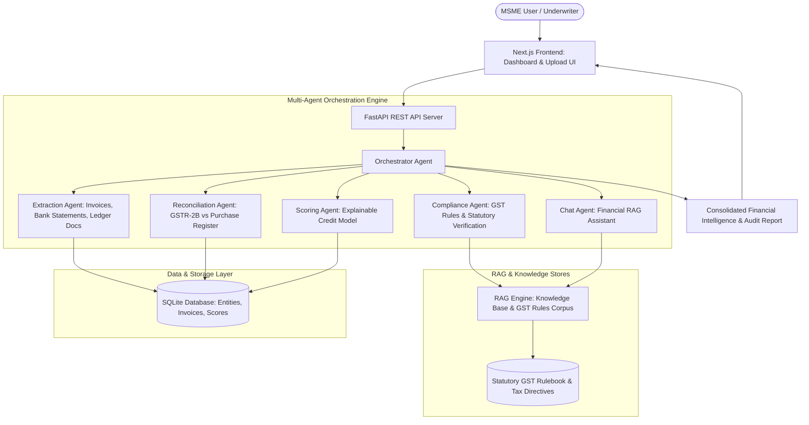

# VittaSetu (वित्तसेतु)

Multi-agent financial intelligence and compliance system designed for India's 63 million Micro, Small, and Medium Enterprises (MSMEs). Integrates document extraction, GST RAG compliance, automated invoice reconciliation, and creditworthiness scoring.

---

## Overview

Indian MSMEs often struggle with formal credit access and complex tax compliance due to fragmented ledger practices, delayed invoice reconciliation, and manual GST validation.

VittaSetu is an end-to-end financial intelligence platform featuring a multi-agent Python backend and a responsive Next.js frontend. It automates financial document parsing, runs automated ledger-to-GST reconciliation, queries statutory compliance rules via Retrieval-Augmented Generation (RAG), and calculates explainable credit risk scores to streamline underwriting.

---

## Architecture & Multi-Agent Pipeline



---

## Key Capabilities

- **Specialized Multi-Agent Coordination**:
  - **Extraction Agent**: Parses structured and semi-structured invoice data, bank statements, and company identifiers.
  - **Compliance Agent**: Validates invoices against Indian Goods and Services Tax (GST) requirements (HSN/SAC codes, reverse charge mechanism, valid tax rates).
  - **Reconciliation Agent**: Matches purchase registers against GSTR-2B inputs, identifying mismatched Input Tax Credit (ITC) claims.
  - **Scoring Agent**: Evaluates cash flow volatility, debt-service coverage, and compliance consistency to produce an explainable credit score.
  - **Chat Agent**: Conversational interface enabling owners to query cash flow status and tax rules in plain English.
- **Statutory GST RAG Engine**: Indexes statutory tax circulars and GST rules to provide cited, compliant guidance.
- **Production Architecture**: Decoupled FastAPI backend and Next.js frontend, deployed on Vercel (`https://vittasetu.vercel.app`).

---

## Technical Stack

- **Backend**: Python 3.10+, FastAPI, SQLite, Pydantic, Uvicorn
- **AI & Retrieval**: Multi-Agent Orchestration, Retrieval-Augmented Generation (RAG), Custom Credit Scoring Models
- **Frontend**: Next.js, React, TypeScript, Tailwind CSS, Lucide Icons
- **Deployment**: Vercel (Frontend), Python API Server (Backend)

---

## Project Structure

```
VittaSetu/
├── README.md
├── backend/
│   ├── main.py                     # FastAPI application entry point
│   ├── requirements.txt            # Python dependencies
│   ├── .env.example                # Configuration template
│   ├── agents/                     # Multi-agent implementations
│   │   ├── orchestrator.py         # Pipeline coordinator
│   │   ├── extraction_agent.py     # Document parser
│   │   ├── compliance_agent.py     # GST tax validator
│   │   ├── reconciliation_agent.py # Ledger & ITC matching
│   │   ├── scoring_agent.py        # Credit risk scoring
│   │   └── chat_agent.py           # Financial assistant
│   ├── rag/                        # RAG engine & GST knowledge corpus
│   ├── scoring/                    # Quantitative credit scoring models
│   ├── api/                        # REST route controllers
│   └── db/                         # Database connection & schema setup
└── frontend/                       # Next.js web application
    ├── src/                        # UI components, pages, and hooks
    ├── package.json
    └── tailwind.config.ts
```

---

## Installation & Setup

### 1. Backend Setup
```bash
cd backend
python -m venv venv
source venv/bin/activate  # On Windows: venv\Scripts\activate

pip install -r requirements.txt
cp .env.example .env

# Run FastAPI server
uvicorn main:app --reload --port 8000
```

### 2. Frontend Setup
```bash
cd frontend
npm install
npm run dev
```
Open `http://localhost:3000` in your browser.

---

## License

MIT License.

## Author

Developed by [Ayush Sharma](https://github.com/Ayush-Sharma99).
